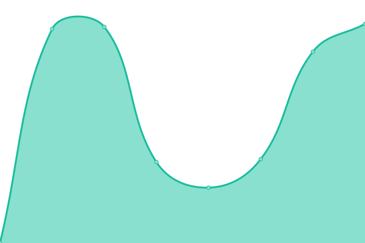
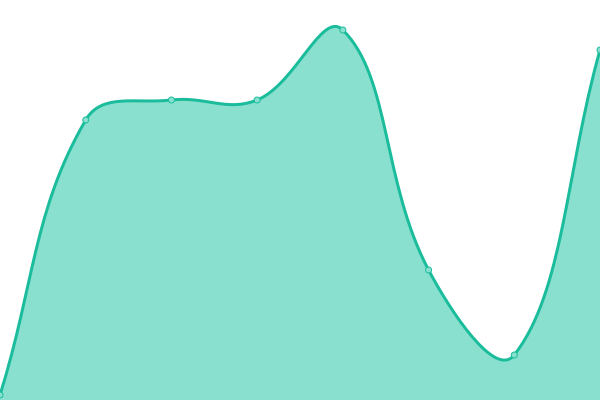

# [📈 Live Status](https://status.taitopia.design): <!--live status--> **🟩 All systems operational**

This repository contains the open-source uptime monitor and status page for [taitopia-dev](https://status.taitopia.design), powered by [Upptime](https://github.com/upptime/upptime).

With [Upptime](https://upptime.js.org), you can get your own unlimited and free uptime monitor and status page, powered entirely by a GitHub repository. We use [Issues](https://github.com/taitopia-dev/taitopia-status-page/issues) as incident reports, [Actions](https://github.com/taitopia-dev/taitopia-status-page/actions) as uptime monitors, and [Pages](https://status.taitopia.design) for the status page.

<!--start: status pages-->
<!-- This summary is generated by Upptime (https://github.com/upptime/upptime) -->
<!-- Do not edit this manually, your changes will be overwritten -->
<!-- prettier-ignore -->
| URL | Status | History | Response Time | Uptime |
| --- | ------ | ------- | ------------- | ------ |
|  [Taitopia Web Application](https://app.taitopia.design) | 🟩 Up | [taitopia-web-application.yml](https://github.com/taitopia-dev/taitopia-status-page/commits/HEAD/history/taitopia-web-application.yml) | 

 497ms
     
 | 

<a href="https://status.taitopia.design/history/taitopia-web-application">100.00%</a>
    

|  [Taitopia Workflow Infrastructure](https://status-api.taitopia.design/health/workflow) | 🟩 Up | [taitopia-workflow-infrastructure.yml](https://github.com/taitopia-dev/taitopia-status-page/commits/HEAD/history/taitopia-workflow-infrastructure.yml) | 

 969ms
     
 | 

<a href="https://status.taitopia.design/history/taitopia-workflow-infrastructure">100.00%</a>
    

|  [Taitopia Asset Management Service](https://status-api.taitopia.design/health/tortilla) | 🟩 Up | [taitopia-asset-management-service.yml](https://github.com/taitopia-dev/taitopia-status-page/commits/HEAD/history/taitopia-asset-management-service.yml) | 

 30ms
     
 | 

<a href="https://status.taitopia.design/history/taitopia-asset-management-service">100.00%</a>
    

|  [Taitopia User Management Service](https://status-api.taitopia.design/health/salsa) | 🟩 Up | [taitopia-user-management-service.yml](https://github.com/taitopia-dev/taitopia-status-page/commits/HEAD/history/taitopia-user-management-service.yml) | 

 29ms
     
 | 

<a href="https://status.taitopia.design/history/taitopia-user-management-service">100.00%</a>
    

|  [Taitopia Render Queue Status](https://status-api.taitopia.design/health/camote) | 🟩 Up | [taitopia-render-queue-status.yml](https://github.com/taitopia-dev/taitopia-status-page/commits/HEAD/history/taitopia-render-queue-status.yml) | 

 30ms
     
 | 

<a href="https://status.taitopia.design/history/taitopia-render-queue-status">100.00%</a>
    

|  [Taitopia Cloud Rendering Service Status](https://status-api.taitopia.design/health/taco) | 🟩 Up | [taitopia-cloud-rendering-service-status.yml](https://github.com/taitopia-dev/taitopia-status-page/commits/HEAD/history/taitopia-cloud-rendering-service-status.yml) | 

 27ms
     
 | 

<a href="https://status.taitopia.design/history/taitopia-cloud-rendering-service-status">96.36%</a>
    

<!--end: status pages-->

[**Visit our status website →**](https://status.taitopia.design)

## 📄 License

- Powered by: [Upptime](https://github.com/upptime/upptime)
- Code: [MIT](./LICENSE) © [taitopia-dev](https://status.taitopia.design)
- Data in the `./history` directory: [Open Database License](https://opendatacommons.org/licenses/odbl/1-0/)
